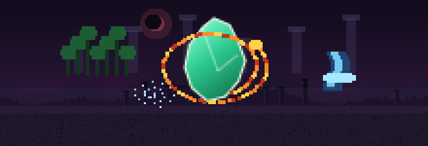
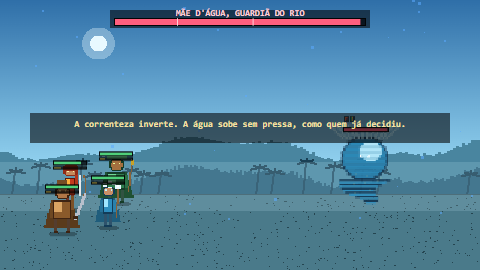
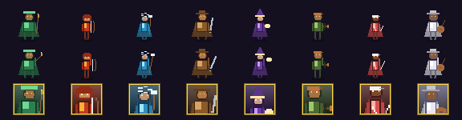
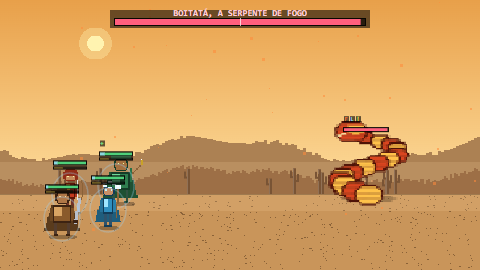
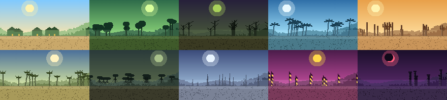
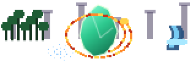

<div align="center">



# Lendas do Brasil: Jornada Encantada

**Um RPG idle de aventura, em pixel art de 16 bits, inspirado no folclore brasileiro.**

Sem dependências. Sem servidor. Sem downloads. Um arquivo `.html` e pronto.

### ▶ [**Jogar agora no navegador**](https://volksec.github.io/lendas-do-brasil/)

[](#tecnologia)
[](#tecnologia)
[](#arte-e-som-nascem-de-código)
[](#arte-e-som-nascem-de-código)
[](#acessibilidade)
[](LICENSE)

</div>

---

## A História

> *A festa do Vilarejo do Sol parou no meio de uma música.*

O **Coração do Brasil** era uma pedra que os anciãos guardavam sem nunca explicar
direito por quê. Ficava numa caixa, atrás do altar, e todo ano alguém a tirava
para a procissão, limpava com um pano e devolvia. Ninguém perguntava.

Naquela noite o céu rachou de leste a oeste. O Coração se partiu em **nove
fragmentos** que saíram voando para todos os cantos do mapa — e para além dele.

O poço secou antes do amanhecer. As galinhas ficaram quietas. E um bicho grande
demais para caber na memória de alguém começou a rondar a mata do lado de fora.

Você tem um mapa mal desenhado, uma carroça emprestada e a certeza incômoda de
que ninguém mais vai fazer isso.



### O que os fragmentos fizeram

Onde um caco do Coração caiu, alguma coisa **entortou**.

Na **Mata dos Sussurros**, os cipós passaram a se mexer sem vento e uma fera
antiga, que dormia sob as raízes desde antes das raízes, não conseguiu mais
dormir. No **Pântano da Cuca** todo mundo dorme demais e acorda mais cansado,
porque alguém está usando um fragmento como travesseiro — e ele sonha junto. No
**Rio das Encantarias** a correnteza subiu contra o próprio caminho, e ninguém no
porto quis explicar por quê.

O **Sertão das Pedras** vê fogo no horizonte três noites seguidas, e o rastro não
vai mais embora de manhã. O **Cerrado dos Ventos** tem tempestade com hora
marcada e senso de humor. No **Manguezal Sombrio**, a maré traz de volta pegadas
humanas muito antigas, e ainda molhadas. Na **Serra dos Cristais**, gravuras
antigas mostram o Coração inteiro sendo partido **de propósito**, por mãos cujo
rosto ninguém desenhou.

E na **Cidade das Máscaras**, onde a festa não para nunca — é por isso que
ninguém percebeu que ela dura três anos —, um mascarado vende um fragmento na
feira, aberto, ao lado dos doces. O preço é justo. Isso é o mais assustador.

### Quem vai com você

Ninguém é herói por vocação. São oito pessoas que estavam por perto quando o céu
rachou e não conseguiram fingir que não viram.



| Herói | Classe | Papel | Elemento |
|---|---|---|---|
| **Guardião da Mata** | Guardião | Tanque | 🌿 Mata |
| **Arqueira do Boitatá** | Arqueira | Dano contínuo | 🔥 Fogo |
| **Curandeira das Águas** | Curandeira | Cura e limpeza | 💧 Água |
| **Cavaleiro do Sertão** | Cavaleiro | Combatente | ⛰ Terra |
| **Feiticeira da Lua** | Feiticeira | Controle mágico | 🌑 Sombra |
| **Caçador do Mapinguari** | Caçador | Dano em alvo único | 🌿 Mata |
| **Mensageiro do Saci** | Mensageiro | Assassino | 🌀 Vento |
| **Bardo do Boto** | Bardo | Suporte | 💧 Água |

O Guardião aparece no terceiro dia sem fazer barulho e diz só: *"Vocês estão indo
devagar demais."* Depois passa na frente e não olha para trás — o que, vindo dele,
é praticamente um convite.

O Mensageiro entrega um recado sem dizer de quem: *"O fragmento não caiu aqui.
Alguém trouxe."* Depois some, levando junto a colher de pau da Curandeira.

### O que espera no fim



Seis guardiões colossais carregam fragmentos no corpo. Nenhum deles é vilão.
Cada um estava fazendo exatamente aquilo para que existia — proteger o campo,
guardar o rio, cobrar caro de quem caça por vaidade — até que um caco do Coração
se cravou onde não devia.


**Boitatá** guarda os campos de quem ateia fogo à toa; o fragmento a deixou
faminta demais para distinguir quem é quem. O **Mapinguari** só queria voltar a
dormir. A **Cuca** coleciona sonos roubados. A **Mãe d'Água** administrava cheias
e secas com mão firme, e agora o rio obedece a outra vontade. O **Corpo-Seco**
nem a terra quis. E **Anhangá**, o espírito branco, foi o primeiro a tocar o
Coração — e o primeiro a se arrepender.

<details>
<summary><b>⚠️ O final (clique só se quiser estragar a surpresa)</b></summary>

<br>

O Vale do Eclipse fica exatamente onde o mapa acaba, e o mapa acaba porque quem o
desenhou parou de voltar.

Com oito fragmentos na bolsa, a resposta finalmente aparece — e é
decepcionantemente simples.

**O Coração não foi roubado. Foi partido pelos próprios guardiões, de propósito**,
porque inteiro ele estava começando a decidir sozinho o que devia viver e o que
não devia. Eles não sabiam o que fazer com uma coisa daquelas. Então quebraram, e
espalharam, e morreram antes de contar a alguém.

Agora vocês seguram os nove pedaços e a mesma escolha. Ninguém vai fazer isso por
vocês.

</details>

---

## As dez regiões

Cada região tem paleta, vegetação, clima, trilha sonora, inimigos, materiais,
capítulo de história e um segredo escondido — todos gerados por código.



<div align="center"><sub>
Vilarejo do Sol · Mata dos Sussurros · Pântano da Cuca · Rio das Encantarias · Sertão das Pedras<br>
Cerrado dos Ventos · Manguezal Sombrio · Serra dos Cristais · Cidade das Máscaras · Vale do Eclipse
</sub></div>

---

## Jogar agora

**No navegador, sem instalar nada:**
### ▶ [volksec.github.io/lendas-do-brasil](https://volksec.github.io/lendas-do-brasil/)

**Offline** — baixe [`dist/index.html`](dist/index.html) e abra com dois cliques.
É um arquivo único de 419 KB, autocontido, que roda sem internet.

**Opção de desenvolvimento** — clone e sirva localmente:

```bash
git clone https://github.com/volksec/lendas-do-brasil.git
cd lendas-do-brasil
python -m http.server 8123
```

E abra `http://localhost:8123`.

> Alguns navegadores bloqueiam `localStorage` em `file://`. O jogo detecta isso e
> continua funcionando com armazenamento em memória, mas para salvar o progresso
> de verdade, use um servidor local ou o arquivo único.

**Gerar o arquivo único você mesmo:**

```bash
node build/build-single.js
```

---

## Controles

| Tecla | Ação |
|---|---|
| `Espaço` | Ativa a primeira suprema disponível |
| `1` `2` `3` `4` | Suprema do herói naquela posição |
| `Esc` | Pausar / retomar |
| `M` · `F` | Mudo · Tela cheia |
| `Tab` · `I` · `Q` · `B` · `C` | Heróis · Bolsa · Missões · Bestiário · Oficina |

No celular tudo funciona por toque. O jogo sugere modo paisagem e avisa quando a
tela é pequena demais.

---

## O que tem dentro

<table>
<tr><td>

| Conteúdo | |
|---|---|
| Heróis jogáveis | **8** |
| Inimigos comuns | **34** |
| Elites | **8** |
| Chefes (2–3 fases) | **6** |
| Regiões | **10** |
| Estágios | **120** + infinito |
| Equipamentos base | **64** |

</td><td>

| Sistemas | |
|---|---|
| Conjuntos de equipamento | **8** |
| Receitas de criação | **24** |
| Missões | **45** |
| Conquistas | **24** |
| Companheiros | **8** |
| Melhorias de renascimento | **10** |
| Elementos de arte | **107** |

</td></tr>
</table>

**Combate**: automático, em tempo real, com dano físico e mágico, cura, escudos,
bônus, penalidades, queimadura, veneno, atordoamento, silêncio, lentidão,
regeneração, crítico, esquiva, roubo de vida e um ciclo elemental de cinco
elementos (🔥 Fogo → 🌿 Mata → ⛰ Terra → 🌀 Vento → 💧 Água → 🔥) mais 🌑 Sombra,
que é neutra contra todos.

**Progressão**: nível, experiência, estrelas, ascensão, vínculo, níveis de
habilidade, seis raridades de equipamento (Comum → Mítico), 14 atributos
secundários sorteados, aprimoramento, reforja, elevação de raridade,
desmontagem, sistema de pity para itens raros.

**Ociosidade**: o grupo luta sozinho, com avanço automático, modo repetição para
farmar e recuo automático quando apanha demais. Uma expedição paralela acumula
recursos enquanto você joga, e o progresso offline continua enquanto o jogo está
fechado — até 24 horas, dependendo das melhorias.

**Renascimento da Lenda**: ao alcançar o estágio 36 você pode recomeçar,
convertendo o progresso em **Essência Lendária** e comprando bônus permanentes.
Itens travados, conquistas, bestiário, segredos e companheiros continuam com você.

**Sem monetização**: sem compras reais, sem caixas de recompensa, sem apostas,
sem energia que expira, sem anúncio. Todo herói, item e melhoria vem de jogar.

---

## Arte e som nascem de código

Não existe um único arquivo `.png` ou `.mp3` neste jogo. **Tudo** é desenhado e
sintetizado em tempo de execução.

Os sprites saem de um gerador paramétrico com doze arquétipos de criatura
(humanoide, fera, serpente, espírito, planta, golem, inseto, ave, peixe,
caranguejo, morcego, geleia), cada um combinado com paleta, arma, chapéu, chifres,
cauda, casco, brilho e escala. Os retratos são recortes automáticos do busto,
calculados a partir da caixa envolvente real do sprite. Os cenários montam céu,
serras, vegetação típica da região e textura de chão a partir de ruído. O
logotipo é vetorizado à mão em código: um cristal facetado, floresta, cachoeira,
serpente de fogo em espiral e um redemoinho.

O áudio usa a Web Audio API: osciladores e ruído filtrado para 25 efeitos, e um
sequenciador que toca uma trilha própria por região, com escala, tônica, andamento
e clima definidos nos dados (a Mata usa dórico a 96 BPM; o Vale do Eclipse, frígio
a 76).

Quer ver tudo? Abra [`tools/spritesheet.html`](tools/spritesheet.html) — ele
desenha os 107 elementos e exporta cada um em PNG.

---

## Tecnologia

HTML, CSS e JavaScript puro. Canvas 2D para a batalha, DOM para as telas.
Nenhum framework, nenhum CDN, nenhuma requisição de rede em tempo de execução.

```
src/
  util.js           formatação (K/M/B/T/Qa/Qi), RNG, DOM, object pools
  localization.js   pt-BR (padrão) + en
  art.js            gerador procedural de pixel art
  audio.js          síntese de efeitos e trilha (Web Audio)
  save.js           localStorage, versionamento, export/import, backup
  combat.js         motor de combate — sem DOM, sem canvas
  idle.js           acúmulo ocioso e recompensas offline
  game.js           estado, progressão, itens, missões, prestígio
  render.js         desenho da batalha em Canvas 2D
  ui.js             todas as telas em DOM
  main.js           laço principal, teclado, tela cheia, autosave
  data/             heróis, inimigos, equipamentos, regiões,
                    missões, companheiros, conquistas, receitas
                    e TODO o balanceamento — separados da lógica
```

A separação é levada a sério: `combat.js` não toca no DOM, `render.js` não altera
o estado, `save.js` não sabe desenhar e `data/` não conhece nada. Por isso o jogo
inteiro roda **sem navegador**, num sandbox de Node com um DOM mínimo — foi assim
que a curva de dificuldade abaixo foi calibrada.

**Desempenho**: delta time em tudo, object pooling para números de dano e
partículas, três níveis de qualidade gráfica, animações pausadas quando a aba
está oculta, gravação periódica (nunca por quadro), cache de sprites.

---

## A curva de dificuldade (e por que ela é polinomial)

Vale contar, porque o primeiro desenho estava errado.

A tentação num RPG idle é fazer o inimigo crescer exponencialmente. Foi o que fiz:
`1.062 ^ estágio`. O problema é que o poder do herói **não** cresce assim. Nível e
equipamento crescem de forma linear no estágio, e ascensão, estrelas e conjuntos
são multiplicadores limitados. Uma exponencial contra uma polinomial só tem um
final possível: por volta do estágio 85 o progresso batia num muro que nenhuma
quantidade de farm resolvia. A simulação mostrou 94% de derrotas e 111 horas para
não chegar ao fim.

A correção foi usar **a mesma família de curva dos dois lados**:

```js
escala(e) = ((1 + (estágio + offset) * k) / (1 + offset * k)) ^ e
```

com `k = 0.12`, `offset = 9`, expoente `2.35` para ataque e `2.85` para vida — e,
crucialmente, **as recompensas usam os mesmos expoentes**, para que o poder de
compra do jogador acompanhe a força do inimigo. É isso que impede muros mesmo
quando é preciso farmar.

Faltava ainda uma peça: derrota não dá recompensa nenhuma, então um grupo travado
farmava eternamente uma luta que não vencia. Daí o **recuo automático** — três
derrotas seguidas e o grupo volta um estágio.

Resultado, em três simulações completas de um jogador eficiente:

| Execução | Estágio final | Derrotas | Tempo ativo |
|---|---|---|---|
| 1 | 120/120 | 18% | 1h15 |
| 2 | 120/120 | 39% | 2h55 |
| 3 | 120/120 | 37% | 2h21 |

Um jogador real, que também lê a história e mexe nos menus, leva mais. Depois do
estágio 120, o Vale do Eclipse continua gerando estágios para sempre.

Tudo isso vive em [`src/data/balance.js`](src/data/balance.js), comentado, com um
guia de ajuste na seção seguinte.

---

## Configuração e modding

| Quero… | Mexa em |
|---|---|
| Jogo mais fácil / difícil | `enemy.expAtk`, `enemy.expHp` (± 0,1 muda muito) |
| Campanha mais longa | reduza `rewards.goldExp` / `xpExp` |
| Combates mais curtos | `combat.baseAttackInterval`, `enemy.base.hp` |
| Chefes mais duros | `enemy.bossMult` |
| Mais equipamento caindo | `loot.dropChance` |
| Raridades altas mais comuns | `loot.weights`, `loot.depthBonus` |
| Subir de nível mais rápido | `hero.xpCurve` |
| Teto de progresso offline | `idle.maxOfflineHours` |
| Renascimento mais cedo | `prestige.unlockStage` |

> **Se alterar `expAtk`/`expHp`, altere `goldExp`/`xpExp` junto** — é o
> acoplamento que mantém a curva estável.

**Adicionar um herói**: copie um bloco em `src/data/heroes.js`. Precisa de
identidade, arte (arquétipo + paleta), atributos base, crescimento por nível,
ataque básico e quatro habilidades — duas ativas, uma passiva e uma suprema. Se a
passiva tiver comportamento especial, registre um gatilho em `G.passiveHooks`.

**Adicionar um chefe**: como um inimigo comum, mais `phases`, onde `at` é a fração
de vida em que a fase começa. `mods` altera atributos, `summon` invoca capangas,
`announce` mostra o texto de virada e `tell` numa habilidade cria o telégrafo — o
círculo pulsante antes do golpe.

**Adicionar uma região**: paleta, tipo de vegetação (`prop`), clima, partículas,
música, listas de inimigos, materiais, capítulo e segredo. Os doze estágios
(elites no 4 e 8, chefe no 12) e o poder recomendado são gerados sozinhos.

A DSL de habilidade, as convenções de atributo e o guia completo de substituição
de arte e áudio estão documentados nos cabeçalhos dos próprios arquivos.

---

## Acessibilidade

- **Português do Brasil** (padrão) e **inglês**, trocáveis em tempo real
- **Tamanho do texto** de 85% a 140%
- **Movimento reduzido**, **tremor de tela** e **números de dano** desligáveis
- **Alto contraste**
- **Raridade nunca depende só de cor** — sempre traz nome e letra (C/I/R/E/L/M)
- **Status nunca dependem só de cor** — cada efeito tem letra sobre a barra de
  vida (F, V, !, S, L, +, ^, v)
- **Teclado**: toda tela tem atalho e todo botão é um `<button>` real
- **Qualidade gráfica** em três níveis, para aparelhos modestos

---

## Sobre a representação cultural

Este é um jogo de fantasia inspirado em lendas populares, não um retrato
etnográfico. Algumas decisões foram deliberadas:

- Vilarejos, cidades, facções e regiões são **fictícios**. Nenhum lugar real do
  Brasil é nomeado nem retratado como perigoso.
- As criaturas são **releituras livres**. Nenhum símbolo sagrado, ritual real,
  liturgia ou material cultural protegido é reproduzido.
- Nenhuma comunidade indígena, quilombola, ribeirinha ou religiosa real é
  representada, nomeada ou usada como cenário.
- Personagens inspirados no folclore são pessoas com motivação própria. Não há
  "nativo primitivo", sotaque caricato nem piada às custas de região ou tradição.
- O humor está nas situações e nas criaturas, nunca na cultura ou na crença de
  alguém.
- Não há conflitos políticos reais, nem alegoria a eles.

---

## Créditos e licença

Código, arte, som, texto e balanceamento originais deste projeto.
Nenhum asset de terceiros — veja a tabela abaixo.

| Categoria | Origem | Licença |
|---|---|---|
| Sprites, retratos, ícones, cenários, logotipo | `src/art.js` | Original (MIT) |
| Efeitos sonoros e trilha | `src/audio.js`, Web Audio API | Original (MIT) |
| Fontes | monoespaçada do sistema | fonte do SO, não distribuída |
| Emoji da interface | caracteres Unicode | desenho vem da fonte do SO |
| Bibliotecas | nenhuma | — |

Distribuído sob a licença [MIT](LICENSE).

<div align="center">
<br>

<br><br>
<sub><i>"Ninguém vai fazer isso por vocês."</i></sub>
</div>
